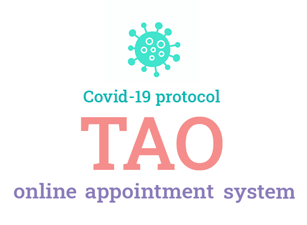

A real-time web-based application to conveniently book appointments through any connected device.

Implemented with Node, Express and a document oriented Database.

The User can identify/login with a Google or Facebook account.

If you would like to learn more about the UX design process please follow [this link](https://www.behance.net/gallery/123788707/TAO-Online-Appointment-System)

Below you can check a screen recording of the UX:

This project utilizes images from freepik.com rawpixel.com and lottiefiles.com (@Chris Gannon and @vectorjuice)